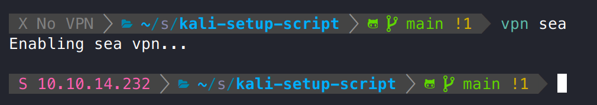
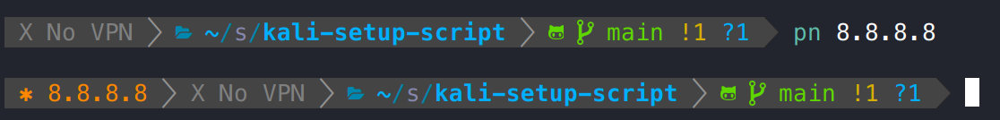
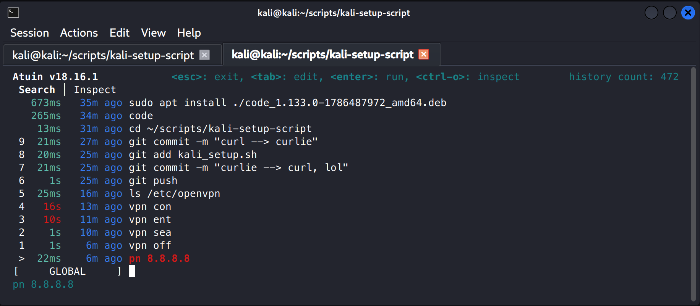

# Kali HackTheBox Configuration Script

## Summary

This script will set up a new Kali linux install to include terminal customization, additional tools, and a custom vpn function.

## Installation

Prior to doing anything on your Kali install, run the following command in your terminal:

`curl -fsSL https://raw.githubusercontent.com/TGathman/kali-setup-script/refs/heads/main/setup.sh | bash`

A few of the programs will require manual interaction in the terminal.

## Added Programs/Customizations

The script adds the following quality of life tools:

* [curlie](https://github.com/rs/curlie)
* [eza](https://github.com/eza-community/eza)
* [bat](https://github.com/sharkdp/bat)
* [btop](https://github.com/aristocratos/btop)
* [imwheel](https://manpages.ubuntu.com/manpages/focal/man1/imwheel.1.html)
* [Oh My Zsh](https://github.com/ohmyzsh/ohmyzsh)
* [Powerlevel10k](https://github.com/romkatv/powerlevel10k)
* [tldr](https://github.com/tldr-pages/tldr)
* [penelope](https://github.com/brightio/penelope)
* [Atuin](https://github.com/atuinsh/atuin)

## Added Configuration Files

The script will replace or add the following configuration files:

* `~/p10k.zsh`
* `~/.zshrc`
* `~/.config/atuin/config.toml`

## Startup Items

The following is added to startup to aid in mouse wheel scroll on a VM:

`imwheel "4 5"`

## Custom Functions and Aliases

The script adds the following functions:

* `vpn`
  * This function enables the HTB vpn
  * Usage: download the VPN config from HTB and move it to `/etc/openvpn`. Name it as follows:
    * Season VPN: `sea.conf`
    * Fortress VPN: `for.conf`
    * Enterprise VPN: `ent.conf`
    * Normal machine VPN: `con.conf`
  * When enabled, an indicator will display in your terminal, e.g.:

  * Turn it off with `vpn off`
  * To add additional VPN types, you must edit the function in `.zshrc`
* `pn`
  * This let's you add a note to the terminal. Use as follows: `pn <note>` e.g.

* aliases are as follows, note `server` (very useful)
  * `alias pn=promptnote`
  * `alias server="python3 -m http.server"`
  * `alias ls='eza $eza_params'`
  * `alias l='eza --git-ignore $eza_params'`
  * `alias ll='eza --all --group --long $eza_params'`
  * `alias lm='eza --all --header --long --sort=modified $eza_params'`
  * `alias lt='eza --all --group --long --tree $eza_params'`
  * `alias ltt='eza --all --group --long --tree --level=2 $eza_params'`
  * `alias la='eza -lbhHigUmuSa@'`
  * `alias tree='lt'`
  * `alias cat='batcat'`
  * `alias sudo='sudo '`   # let aliases expand after sudo

## Atuin

Atuin replaces your existing shell history with a SQLite database, and records additional context for your commands. Check it out here: <https://github.com/atuinsh/atuin>.

`Ctrl + Up` will access the Atuin history:

## Closing

As I continue to update this repo, I may add verisoning commits. I am also always looking for useful additional tools to add to Kali. As of right now, I don't use any agentic tools or AI outside of web-based Claude, ChatGPT, etc., but that may come in the future.